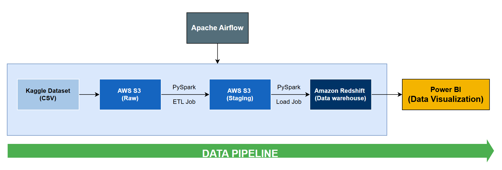

<h1 align="center">🚀 Retail AWS Data Warehouse Pipeline 🚀</h1>

## 📌 Tổng quan

Dự án này là một hệ thống **Data Warehouse có khả năng mở rộng**, được thiết kế để xử lý và phân tích dữ liệu chuỗi cung ứng bán lẻ. Hệ thống sử dụng các dịch vụ **AWS** và các công cụ **Data Engineering hiện đại** nhằm xây dựng một **hạ tầng dữ liệu mạnh mẽ**, hỗ trợ doanh nghiệp đưa ra quyết định dựa trên dữ liệu.

Hệ thống này giúp doanh nghiệp **tối ưu hoạt động kinh doanh** thông qua các phân tích chuyên sâu (*insight*), bao gồm:

- **📊 Phân tích quá trình đặt hàng và giao hàng** – Phân tích thời gian giao hàng và phương thức vận chuyển để tối ưu hóa quy trình giao hàng và giảm thiểu các trường hợp giao hàng muộn.
- **📦 Phân tích doanh thu bán hàng** – Phân tích cung cầu để tránh tình trạng thiếu hàng hoặc dư thừa hàng hóa.
- **🛒 Phân tích hành vi khách hàng và phương thức thanh toán** – Phân khúc khách hàng dựa trên thói quen mua sắm để cá nhân hóa chiến lược marketing.
- **⚙️ Hiệu suất vận hành** – Phát hiện các nút thắt trong chuỗi cung ứng để tối ưu hóa logistics và thời gian giao hàng.
---

## 🏗️Data Pipeline Workflow

1. **Ingestion**: Raw data is downloaded from [Kaggle Dataset](https://www.kaggle.com/datasets/alinoranianesfahani/dataco-smart-supply-chain-for-big-data-analysis) and stored in **AWS S3**.
2. **Processing (ETL)**:
   - PySpark processes the data, performs transformations, and loads it into **staging S3**.
3. **Loading**: Transformed data is loaded into **Amazon Redshift**.
4. **Analysis**: Power BI connects to Redshift for interactive dashboards.
5. **Automation**: Airflow schedules and monitors the pipeline.
6. **Containerized Deployment**: Use **Docker** for easy orchestration.
---
## Thiết kế data warehouse
### 1. Thông tin bộ dữ liệu
Bộ dữ liệu "DataCo Smart Supply Chain for Big Data Analysis" được thu thập từ trang Kanggle. Bộ dữ liệu gồm có 3 file chính, đó là:
1. DataCoSupplyChainDataset.csv: chứa các thông tin chi tiết về các đơn đặt hàng của khách hàng.
2.  tokenized_access_logs.csv: chứa các thông tin liên quan đến sản phẩm
3.  DescriptionDataCoSupplyChain.csv: chứa các mô tả về thông tin các thuộc tính trong bộ dữ liệu DataCoSupplyChainDataset.csv.
   Dữ liệu cần được xử lý nằm trong file DataCoSupplyChainDataset.csv.

## Attributes

| **Attribute**                     | **Description**                                                                 |
|:----------------------------------:|:--------------------------------------------------------------------------------:|
| **Type**                          | Type of transaction made.                                                       |
| **Days for shipping (real)**      | Actual shipping days of the purchased product.                                  |
| **Days for shipment (scheduled)** | Days of scheduled delivery of the purchased product.                            |
| **Benefit per order**             | Earnings per order placed.                                                      |
| **Sales per customer**            | Total sales per customer made per customer.                                     |
| **Delivery Status**               | Delivery status of orders.                                                      |
|                                   | **Values**: Advance shipping, Late delivery, Shipping canceled, Shipping on time|
| **Late_delivery_risk**            | Indicates if shipping is late.                                                  |
|                                   | **Values**: 1 (Late), 0 (Not late)                                               |
| **Category Id**                   | Product category code.                                                          |
| **Category Name**                 | Description of the product category.                                            |
| **Customer City**                 | City where the customer made the purchase.                                      |
| **Customer Country**              | Country where the customer made the purchase.                                   |
| **Customer Email**                | Customer's email address.                                                       |
| **Customer Fname**                | Customer's first name.                                                          |
| **Customer Id**                   | Unique customer ID.                                                             |
| **Customer Lname**                | Customer's last name.                                                           |
| **Customer Password**             | Masked customer key.                                                            |
| **Customer Segment**              | Types of Customers: Consumer, Corporate, Home Office.                           |
| **Customer State**                | State where the store is registered.                                            |
| **Customer Street**               | Street where the store is registered.                                           |
| **Customer Zipcode**             | Customer's Zipcode.                                                             |
| **Department Id**                 | Department code of the store.                                                   |
| **Department Name**               | Department name of the store.                                                   |
| **Latitude**                       | Latitude corresponding to the location of the store.                            |
| **Longitude**                      | Longitude corresponding to the location of the store.                           |
| **Market**                         | Market to where the order is delivered. **Values**: Africa, Europe, LATAM, Pacific Asia, USCA.|
| **Order City**                     | Destination city of the order.                                                  |
| **Order Country**                  | Destination country of the order.                                               |
| **Order Customer Id**             | Customer order code.                                                           |
| **Order Date**                     | Date on which the order was made.                                               |
| **Order Id**                       | Unique order code.                                                              |
| **Order Item Cardprod Id**         | Product code generated through the RFID reader.                                 |
| **Order Item Discount**            | Discount value for the order item.                                              |
| **Order Item Discount Rate**      | Discount percentage for the order item.                                         |
| **Order Item Id**                 | Unique code for the order item.                                                 |
| **Order Item Product Price**      | Price of the product without discount.                                          |
| **Order Item Profit Ratio**       | Profit ratio for the order item.                                                |
| **Order Item Quantity**           | Number of products per order.                                                   |
| **Sales**                          | Total sales value.                                                              |
| **Order Item Total**              | Total amount for the order item.                                                |
| **Order Profit Per Order**        | Profit earned per order.                                                        |
| **Order Region**                  | Region of the world where the order is delivered. **Values**: Southeast Asia, South Asia, Oceania, and more. |
| **Order State**                   | State of the region where the order is delivered.                               |
| **Order Status**                  | Status of the order: **Values**: COMPLETE, PENDING, CLOSED, PENDING_PAYMENT, CANCELED, PROCESSING, SUSPECTED_FRAUD, ON_HOLD, PAYMENT_REVIEW.|
| **Product Card Id**               | Unique product code.                                                           |
| **Product Category Id**           | Product category code.                                                          |
| **Product Description**           | Product description.                                                            |
| **Product Image**                 | Link to visit and purchase the product.                                         |
| **Product Name**                  | Name of the product.                                                            |
| **Product Price**                 | Price of the product.                                                           |
| **Product Status**                | Stock status of the product. **Values**: 1 (not available), 0 (available).       |
| **Shipping Date**                 | Exact date and time of shipment.                                                |
| **Shipping Mode**                 | Shipping modes presented: **Values**: Standard Class, First Class, Second Class, Same Day. |

## 📦 Setup & Deployment

### Prerequisites
- AWS account (S3, Redshift setup)
- Docker & Docker Compose
- Airflow installed
- PySpark installed

### Steps to Run

1. **Clone the Repository**
   ```bash
   git clone https://github.com/Duong27102001/retail_aws_pipeline.git
   cd retail_aws_pipeline
